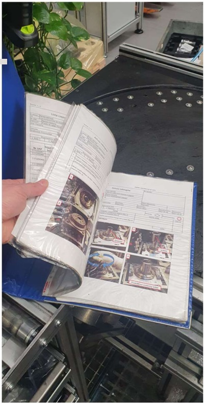
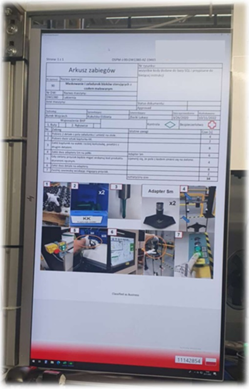

# DocViewer

App to visualize documentation for operators on their work stations.

## General Information

Background:
The idea appeared during one of the project led by me.
Because of lots of products produced on various work stations, there were lots of paper documentation around.
Finding needed documentation costs huge amount of time.

The problem:
That huge amount of paper documentation caused that operators found it difficult to collect needed information. In most cases loosing lots of time to do so.
I noticed that in order to avoid loosing time, during checking documention, workers started to work not according to instructions given in documentation = Quality concerns.

The solution:  
Creation of desktop application for visualization of documentation that are only needed during producing specific product.
No papers will be needed. Information given to operators will be focused only on what is needed in current process stage.
Documents will be presented in two languages.
App is easy to install and configure.

## Technologies Used

* WPF .Net
* .NET 7.0
* C#
* XAML
* XML

## Architecture / design patterns

* Onion Architecture
* Model-View-ViewModel

## Features

* Extracting needed documentation by proiduct number.
* Visualization of needed documentaion on work station.
* Ability to scroll documents forward/backward.
* Presentation of documents in different lenguages.
* Easy configuration on new working station.
* Saving window size and its possition for custom setup purpose.

## Features for further development

* Ability to work with touch screens.
* Work with remote databases like MSSQL, Azure, AWS and others.
* Build in tool to implement new code numbers and related documentation.

## Some photos

* Documentation on production stand - imagine you need to pick only pages that are needed for specified product to produce.

* DocViewer App - implement product code and needed documentation will be extracted.

## Creator

Created by Lukas Zlocki  
